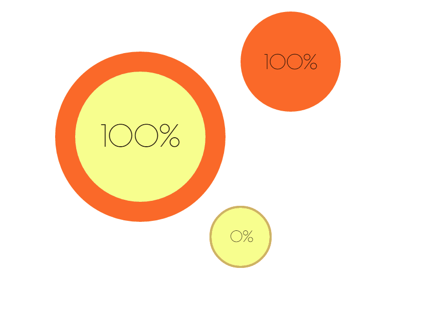

# RadialBar (v.0.2.0)

**Эта JavaScript библиотека позволяет создавать радиальные прогресс бары на canvas.**
 

  
## Пример

```javascript
 var canvas = document.getElementById('paper');
 var ctx = canvas.getContext('2d');

 var bar = new RadialBar(ctx, {
 	x: 500,
 	y: 500,
 	radius: 60,
 	lineWidth: 4,
 	lineFill: '#CCB566',
 	backLineFill: '#FB6929',
 	bgFill: '#F8FF8E',
 	progress: 100,
 	isShowInfoText: true,
 	infoStyle: '30px Arial',
 	infoColor: 'red'
 });

 // Update
 function loop() {
 	ctx.clearRect(0, 0, canvas.width, canvas.height);
 	
 	// добавляем      
 	bar.add(0.1);
 	
 	// перерисовываем
 	bar.update();

 	requestAnimationFrame(loop);
 }
 loop();
```
  
## Чтобы начать 
  
Чтобы создать новый прогресс бар
  
```javascript
 var bar = new RadialBar(context, config);
```
  
* context - это полученный методом 'getContext('2d') контекст канваса.
* config - это объект с описанием конфигурация прогресс бара
  
## Свойства config

* x: **Integer** позиция центра окружности по x координате
* y: **Integer** позиция центра окружности по y координате
* angle: **Integer** задает угол наклона
* radius: **Integer** радиус окружности
* lineWidth: **Integer** ширина линии окружности (прогресс бар)
* lineFill: **String (Color)** цвет заливки линии окружности (прогресс бар)
* backLineFill: **String (Color)** цвет задний заливки (за линией окружности)
* bgFill: **String (Color)** цвет самого прогресс бара (центр окружности)
* progress: **Integer (Percentage)** значение в процентах от 0 до 100, позволяет указать на сколько процентов нужно заполить прогресс бар
* isShowInfoText: **Boolean** показывать ли в центре прогресс в процентах (вид: value%)
* infoStyle: **String (FontStyle)** позволяет указать стили для текста, как это делает свойство font в стандартном canvas API (например: '50px Arial')
* infoColor: **String (Color)** позволяет указать цвет текста
* isStop: **Boolean** Останавливает и запускает прогресс бар
  
## Методы RadialBar
* styles(config) - задает все свойства конфига (используется так же в конструкторе)
* set(val) - устанавливает в прогресс баре значение val, где val число от 0 до 100
* add(val) - добавляет значение val в прогресс бар, где val число от 0 до 100
* subtract(val) - вычитает значение val в прогресс баре, где val число от 0 до 100
* update() - вызывается после вызова set, add и subtract, чтобы обновить значения визуально на холсте 
* get() - возвращает строку типа 'value %', где value число от 0 до 100
  
## Свойства RadialBar
  
* все свойства, которые возможно записать в config
* PERCENT_DEG - константа, которая ровняется 360/100 (1% от 360 грудусов)
* degProgress - количество градусов, вычисляется так, progress (% загрузки) * PERCENT_DEG

## Автор
 
 **Андрей Жевлаков (@AZbang)**
 * __[VK](https://vk.com/id216312691)__
 * __[Group in VK: AZbang | Web Development](https://vk.com/azbang)__
 * __[Official Website](https://azbang.github.io/)__
 * __[Telegram](https://telegram.me/AZbang)__
